# UTS Pratikum 7 - Membuat Aplikasi Pemesan Buku
### NAMA : Raihan Ardiansyah
### NIM : 312410396
### KELAS : TI.24.A3

**Halaman Login (login.html)**

Input: email dan password.

• Tombol “Login”

• Jika salah atau tidak sesuai, munculkan pop-up/alert yang berisi bahwa "email/password
yang anda masukkan salah"

• Terdapat tombol “Lupa Password” dan “Daftar” yang dimunculkan dalam

• bentuk modal box/pop up

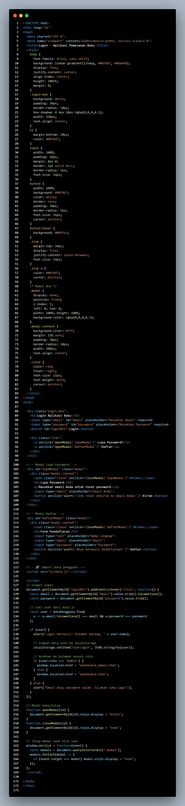

 

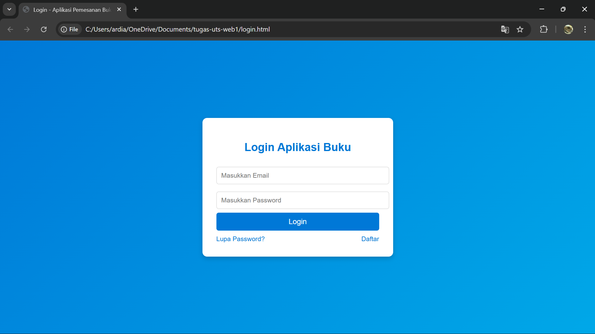

**Dashboard Menu (dashboard.html)**

• Menu utama yang terdiri atas tombol navigasi ke:

o Informasi Stok/Katalog

o Tracking Pengiriman

o Laporan Pemesanan

o Histroy Transaksi

• Tampilkan “greeting” berdasarkan waktu local time (pagi/siang/sore).

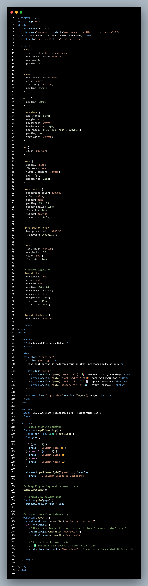

 

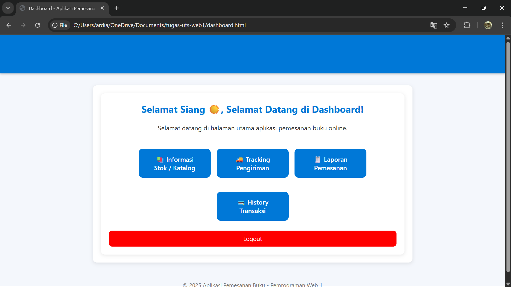

**Informasi Stok/Katalog (stok.html)**

• Menampilkan secara dinamis dari data dummy pada data.js di variable konstanta
dataKatalogBuku

• Terdapat fitur untuk menambahkan baris stok baru menggunakan Javascript DOM

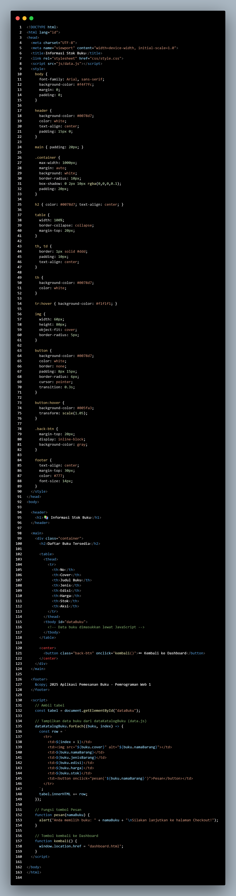

 

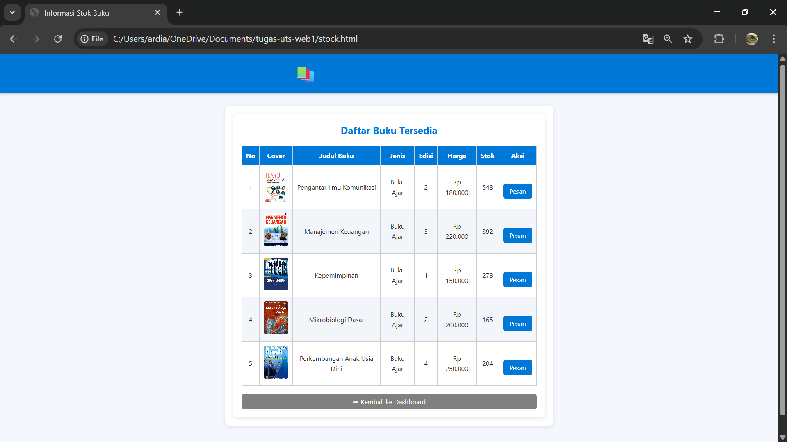

**Halaman Pemesanan (checkout.html)**

• Menampilkan data pemesanan yang dapat ditambah/ubah.

• Terdapat isian data informasi pemesan dan pembayaran.

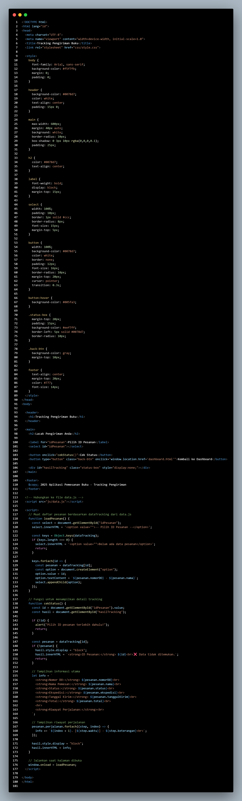

 

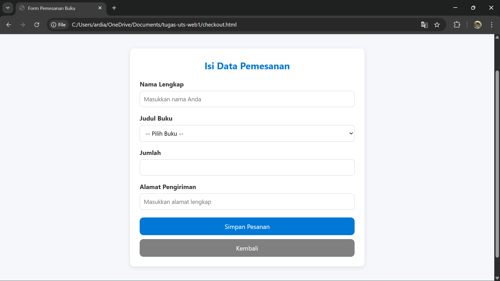

**Informasi Pengiriman (tracking.html)**

• Input: Nomor Delivery Order

• Ketika tombol "Cari" ditekan, tampilkan:

o Nama Pemesan

o Status Pengiriman (dapat disimulasikan dengan progress bar, warna, tabel, atau
list sesuai dengan kemampuan dan kreativitas anda)

o Detail ekspedisi, tanggal kirim, jenis paket, total pembayaran.

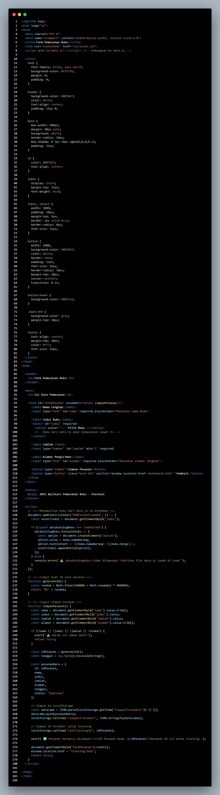

 

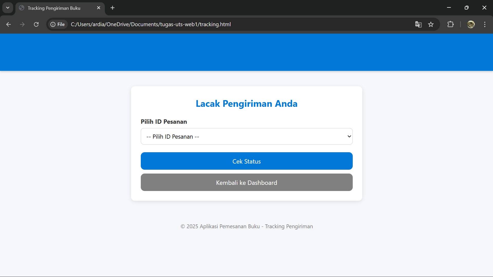

**Halaman History ( history.html)**

• Halaman History berfungsi untuk menampilkan daftar riwayat pemesanan buku yang telah dilakukan oleh pengguna.

• Menampilkan seluruh pesanan yang sudah dilakukan pengguna.

• Memuat data pesanan seperti ID Pesanan, Nama Pemesan, Judul Buku, Jumlah, Alamat Pengiriman, dan Tanggal Pemesanan.

• Memberikan akses cepat bagi pengguna untuk melihat status pesanan dan melakukan tracking.

• Data riwayat dapat terus bertambah seiring pengguna melakukan pemesanan baru.

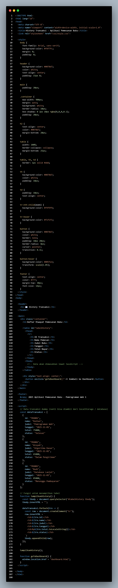

 

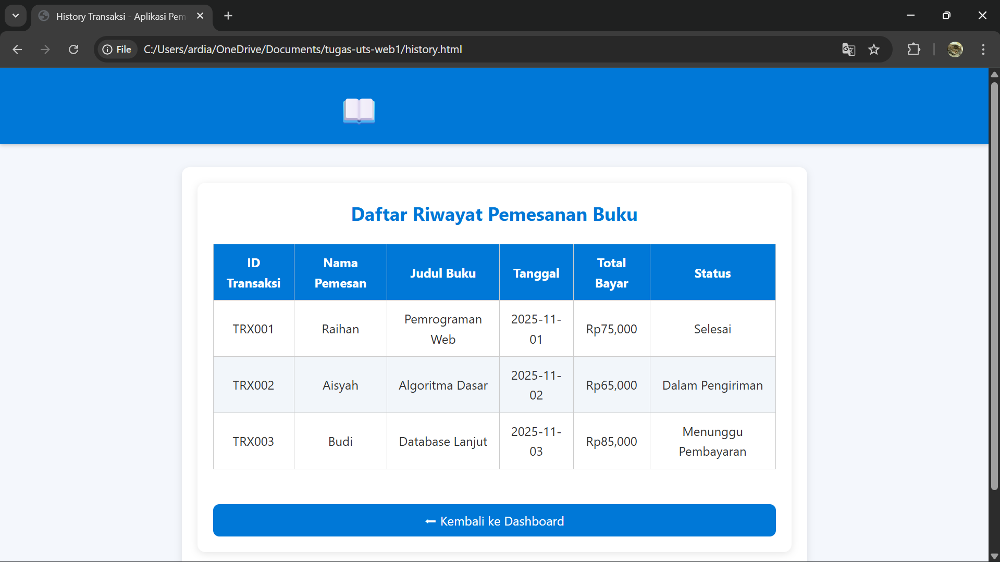

**Untuk struktur folder project dibuat seperti ini:**

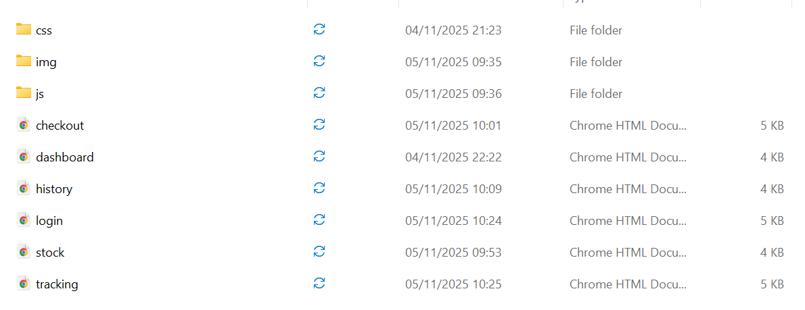

**Folder JS(JavaScript)**

**Style.js**

File style.js berfungsi untuk mengatur interaksi dan perilaku dinamis tampilan (UI/UX) pada website.
Jika file style.css mengatur tampilan statis seperti warna, ukuran, dan posisi elemen, maka style.
js mengatur bagaimana elemen-elemen itu bereaksi terhadap tindakan pengguna, misalnya klik, scroll, hover, atau input.

1. Mengontrol interaktivitas halaman

• Mengatur efek animasi, transisi, atau perubahan tampilan secara dinamis.

• Contoh: tombol berubah warna saat diklik, menu navigasi muncul/tertutup, dll.

2. Menangani event dari pengguna

• Seperti klik tombol, input teks, submit form, atau scroll halaman.

• Contoh: saat tombol Logout diklik, pengguna diarahkan ke halaman login.html.

3. Memanipulasi elemen DOM (Document Object Model)

• Dapat menambah, menghapus, atau mengubah isi elemen HTML secara langsung.

• Contoh: menampilkan pesan “Selamat Datang” dengan nama pengguna dari localStorage.

4. Mengelola tema dan gaya dinamis

• Bisa dipakai untuk mengganti tema (dark/light mode) atau warna elemen sesuai pilihan pengguna.

5. Meningkatkan pengalaman pengguna (UX)

• Membuat website terasa lebih interaktif dan “hidup” dibanding halaman statis murni HTML & CSS.

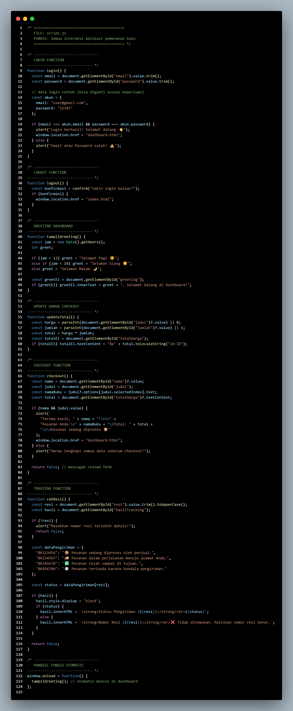

**data.js**

File data.js berfungsi untuk menyimpan dan mengelola data utama yang digunakan dalam website.
Biasanya, file ini berisi kumpulan data statis dalam bentuk array atau objek JavaScript, seperti data pengguna, data katalog barang, atau data riwayat transaksi.

Dengan kata lain, data.js adalah “sumber data sementara” yang digunakan oleh halaman web — tanpa perlu terhubung ke database sebenarnya.

1. Sebagai tempat penyimpanan data (data source)

• Menyimpan data pengguna, data katalog buku, dan data tracking pengiriman.

• Data ini bisa dipanggil dari halaman lain seperti login, katalog, atau history.

2. Menyimulasikan database

• Dalam proyek latihan atau demo, data.js berperan seperti database mini yang menampung semua informasi.

• Jadi web tetap bisa berjalan meskipun belum terkoneksi ke server/database nyata

3. Memudahkan pengelolaan dan pemanggilan data

• File ini memisahkan antara data dan logika program.

• Hal ini membuat kode jadi lebih terstruktur, mudah dibaca, dan mudah diperbarui.

4. Digunakan untuk menampilkan informasi di halaman web

• Data dari data.js akan dipanggil lewat JavaScript di halaman lain untuk ditampilkan secara dinamis (misalnya daftar buku, status pengiriman, dll).

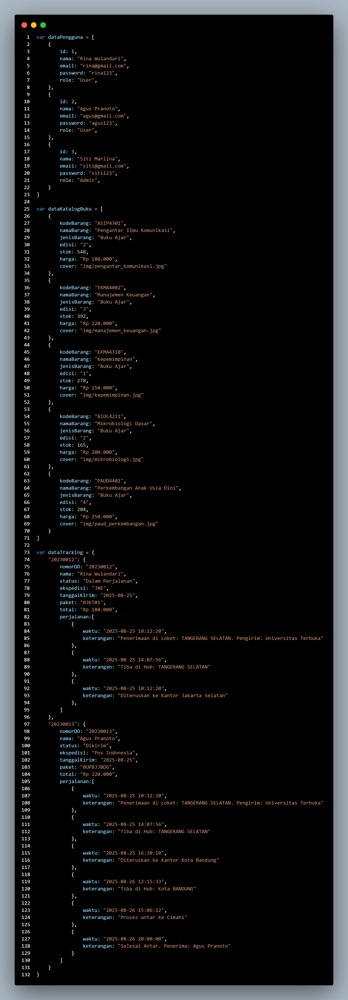

**Folder CSS**

**style.css**

File style.css berfungsi untuk mengatur tampilan (desain visual) dari seluruh halaman web.
Semua elemen seperti warna, ukuran huruf, tata letak, margin, padding, tombol, hingga efek hover diatur melalui file ini.

Dengan kata lain, style.css adalah “baju” dari website — membuat halaman yang awalnya polos jadi menarik, rapi, dan nyaman dilihat.

1. Mengatur tampilan halaman web

• Menentukan warna latar belakang, warna teks, bentuk tombol, dan posisi elemen.

• Memberikan kesan profesional dan konsisten di setiap halaman (seperti login, dashboard, pemesanan, dan history).

2. Meningkatkan pengalaman pengguna (User Experience / UX)

• Desain yang rapi memudahkan pengguna memahami alur sistem dan navigasi website.

3. Memisahkan logika (HTML/JS) dari tampilan

• Dengan CSS, tampilan dipisahkan dari struktur (HTML) dan fungsi (JavaScript), sehingga kode lebih terorganisir dan mudah dirawat.

4. Memberikan efek interaktif

• Contohnya efek perubahan warna saat kursor diarahkan ke tombol (hover), animasi transisi, atau bayangan pada elemen (shadow).

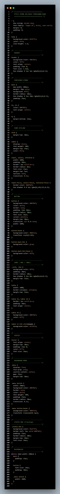
